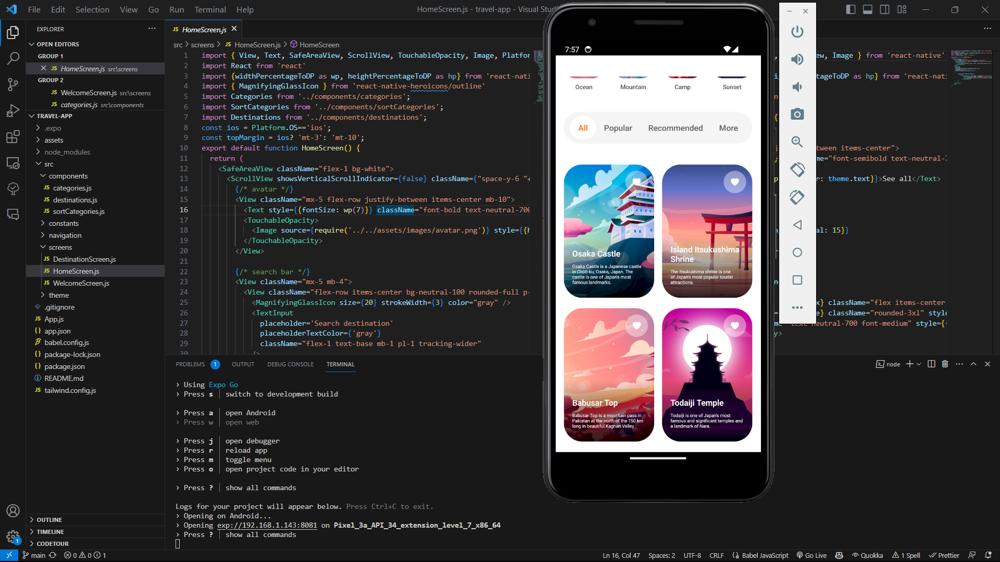
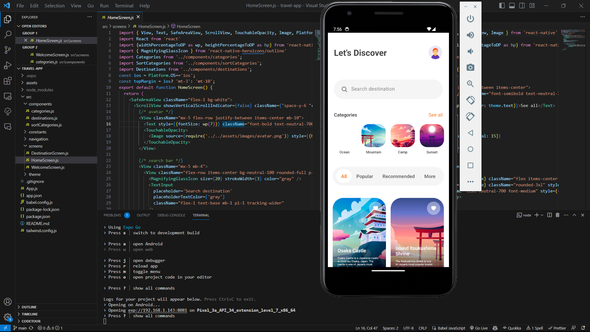
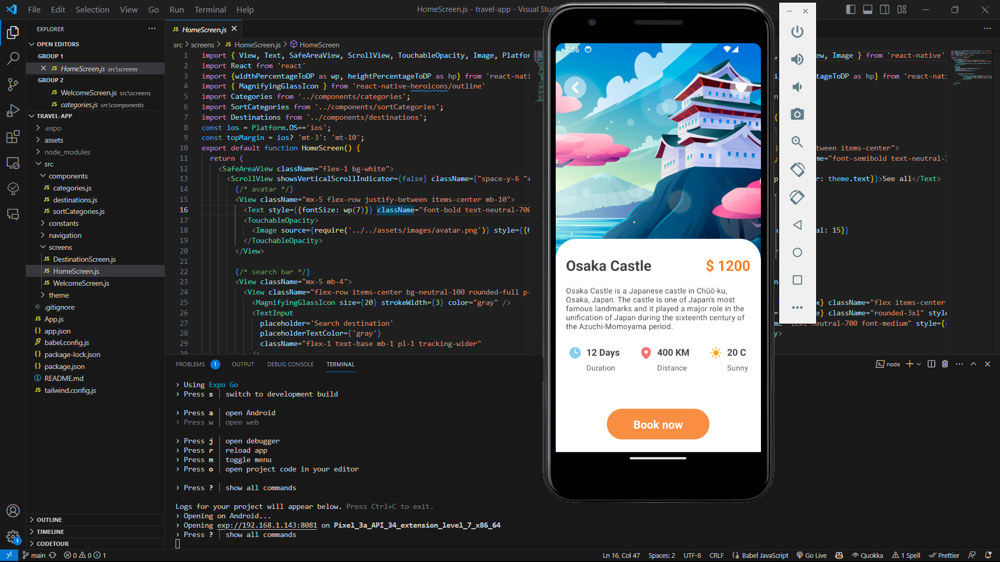

# Travel-App

  

## Get Started

install dev dependencies

### `npm install` or `yarn install`

## Then

Run The app

### `npm start` or `yarn start`
## Video
[![Video]](https://mailuc-my.sharepoint.com/personal/cheemadu_mail_uc_edu/_layouts/15/stream.aspx?id=%2Fpersonal%2Fcheemadu%5Fmail%5Fuc%5Fedu%2FDocuments%2FRecordings%2FCall%20with%20Kunda%2C%20Nethaji%20Lakshman%20%28kundann%29%2D20240421%5F195223%2DMeeting%20Recording%2Emp4&ga=1&referrer=StreamWebApp%2EWeb&referrerScenario=AddressBarCopied%2Eview)

